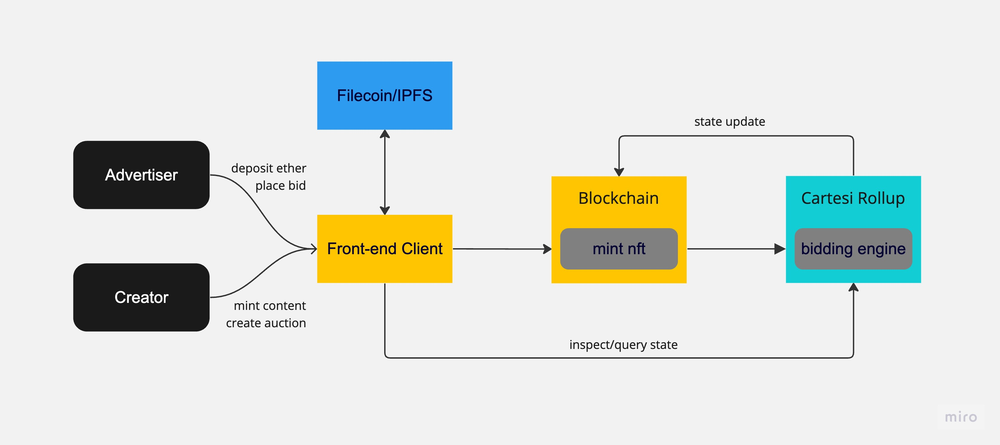

# DecentrAds
Decentralized AdSpace is a p2p social media platform with a decentralised advertisement layer on top. The dApp lets a user create content and put it on bidding for ad placements. The advertisers look at the metrics of a content page and place their bids. A simple auction algorithm then selects the highest bidder.

## Tech used
Backend - Cartesi to compute the dynamic bid amount of ad space. The contracts are deployed on arbitrum goerli.
Frontend - ReactJS framework

## Architecture

